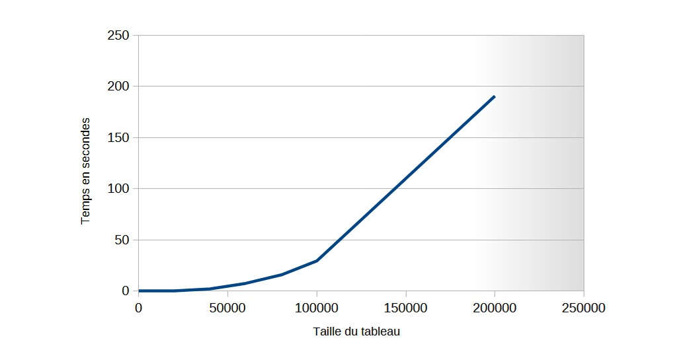
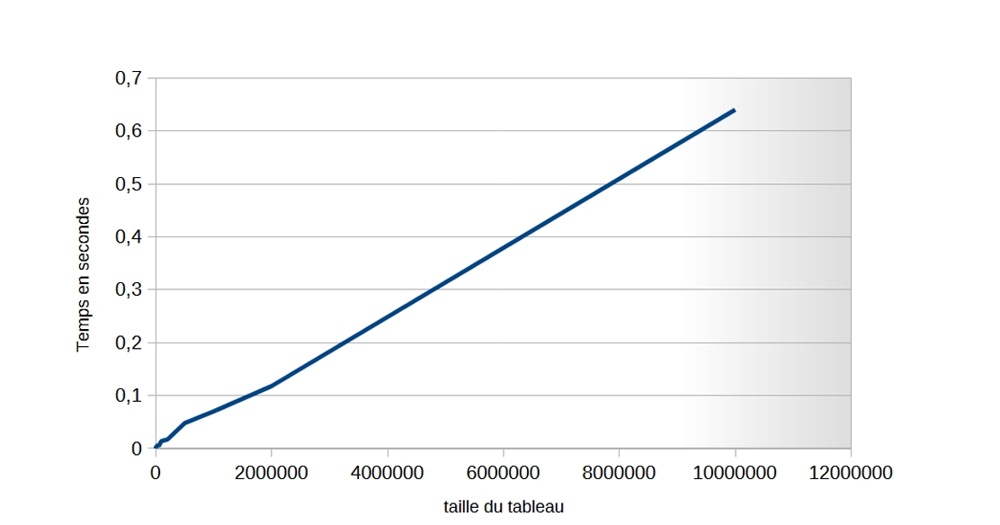
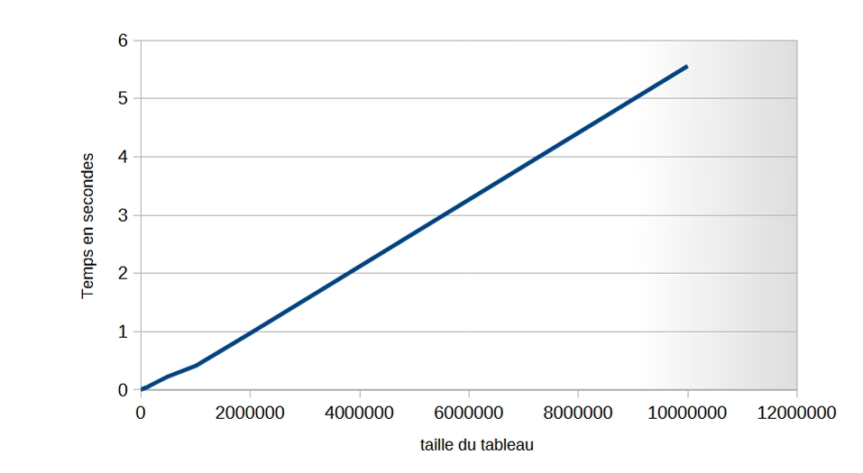
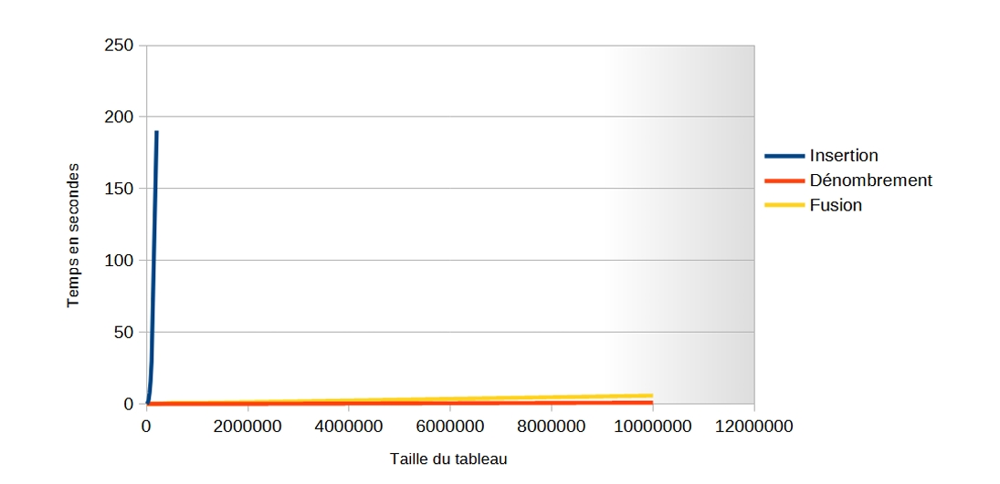

#  Le Tri par Insertion

##  Le principe du tri par insertion

Le tri par insertion est un algorithme de tri simple, classique et efficace. Son principe repose sur un parcours de tableau à partir du deuxième élément, et de comparer l’élément choisi avec ses précédents dans ce tableau jusqu’à se retrouver à la bonne position. 

Au cours du processus, les éléments qui se trouvent avant l’élément courant seront déjà triés et ceux qui se trouvent après ce dernier restent à trier. Pour savoir où on doit mettre un élément parmi ceux qui le précèdent, on le compare à ceux-ci, et on décale pour faire de la place pour effectuer l’insertion. On continue jusqu’à avoir tous les éléments triés.

---

## I.2. Algorithme du tri par insertion

***Algorithme***

```text
Début triInsertion (T: tableau, taille: entier)
    Pour i allant de 1 à taille - 1
        tmp ← T[i]
        j ← i - 1
        Tant que j >= 0 et tmp < T[j]
            T[j + 1] ← T[j]
            j ← j - 1
        Fin Tant que
        T[j + 1] ← tmp
    Fin Pour
Fin triInsertion 
```
## La complexité du tri par insertion

La complexité de l’algorithme du tri par insertion peut varier selon la nature des données en entrée. Pour cela, on peut distinguer trois cas :

###  Le pire des cas  
Dans ce cas, on suppose que le tableau donné en entrée est trié dans l’ordre inverse (décroissant). Chaque élément doit alors être déplacé jusqu’à la première position.  

- **Boucle `pour`**  
  La première boucle va de 1 à `n` (soit `n-1` itérations).  

- **Boucle `tant que`**  
  Le nombre d’instructions exécutées dans cette boucle dépend de la taille du tableau passé en paramètre.  
  Dans le pire des cas, si la décrémentation de `j` (`j = j - 1`) est exécutée jusqu’à ce que la condition `(j >= 0)` soit fausse, on aura `i` instructions (car `j` prendra des valeurs entre `i-1` et `-1`).
### Le calcul  de la complexité
Enfin, on peut calculer la complexité :  
Le nombre d’instructions est :  
`1 + 2 + 3 + 4 + … + (n – 1)`  

On utilise la formule de la somme des entiers consécutifs de 1 à n, qui est :  
\[ S = \frac{n}{2} \times (n – 1) \]  

Dans notre cas, la somme va de 1 à \( (n - 1) \), donc on obtient :  
\[ S = \frac{(n – 1) \times n}{2} \]  

En développant le calcul, on obtient :  
\[ S = \frac{n^2}{2} – \frac{n}{2} \]  

Puisque \( n^2 \) est le terme le plus dominant, la complexité du tri par insertion est :  
\[ O(n^2) \]  

Il s’agit donc d’une ***complexité quadratique***.

En obtenant cette complexité de nature quadratique, on peut comprendre que le temps d’exécution de l’algorithme augmentera significativement avec l’augmentation de la taille du tableau. Cela peut directement amener à la conclusion que ce tri devient inefficace pour des tableaux de grandes tailles en raison du nombre d’instructions qui augmente également.

---

### 2. Le moyen des cas

Ce cas est le plus fréquent. On considère ici un tableau avec des éléments triés aléatoirement. Dans ce scénario :  
- Certains tableaux nécessiteront moins d’instructions, tandis que d’autres peuvent en nécessiter davantage, en fonction de la répartition aléatoire des éléments.  
- Globalement, le nombre d’instructions est réduit comparé au pire des cas.  

Cependant, **la complexité reste quadratique** (\( O(n^2) \)) en raison des itérations effectuées et de la nature de l’algorithme. Cela ne garantit pas des performances identiques à celles du pire des cas, mais la croissance du temps d’exécution demeure significative.

---

### 3. Le meilleur des cas

Dans le cas idéal, si le tableau est déjà trié dans l’ordre croissant, aucune permutation n’est nécessaire. Dans ce cas, chaque élément ne nécessitera qu’une seule comparaison avant de passer au suivant.  

Ainsi, la complexité devient **linéaire** :  
\[ O(n) \]  
Ce cas est extrêmement performant, mais il est rarement rencontré en pratique.
## Le temps d’exécution en fonction de la taille du tableau

Dans cette section, nous analysons le temps d’exécution de l’algorithme du tri par insertion en fonction de la taille du tableau. Nous commençons par des tableaux de petites tailles, puis augmentons progressivement leur taille pour observer l’évolution du temps d’exécution. Ces observations nous permettent de juger de l’efficacité de l’algorithme, notamment sur des grandes tailles.  

*(Remarque : l’exécution du code et le calcul des temps ont été réalisés sur nos propres ordinateurs.)*

---

### Résultats expérimentaux

| Taille du tableau | Temps d’exécution (en secondes) |
|-------------------|----------------------------------|
| 10                | 0.000                           |
| 100               | 0.001                           |
| 500               | 0.015                           |
| 1000              | 0.017                           |
| 5000              | 0.044                           |
| 10000             | 0.115                           |
| 20000             | 0.480                           |
| 40000             | 2.19                            |
| 60000             | 7.5                             |
| 80000             | 15.8                            |
| 100000            | 29.48                           |
| 200000            | 190.5                           |

---

### Analyse des résultats

Les données présentées dans ce tableau montrent une **variation significative du temps d’exécution** en fonction de la taille du tableau. Voici quelques observations :

1. **Pour de petites tailles de tableau** (10, 100, 1000), le temps d’exécution est très faible, ce qui indique des performances rapides de l’algorithme.  
2. **Pour des tableaux plus grands** (10000, 100000, 200000), le temps d’exécution augmente considérablement, démontrant que la complexité quadratique \( O(n^2) \) devient prédominante lorsque la taille du tableau croît.  
3. Au-delà de 200000 éléments, **l’algorithme devient extrêmement lent**, voire incapable de fournir une réponse dans un délai raisonnable.  

---

### Conclusion

On peut conclure que l'algorithme du tri par insertion est **inefficace pour les tableaux de grandes tailles** en raison de sa complexité quadratique. Cette inefficacité est particulièrement visible sur des tailles de tableaux dépassant 200000 éléments.  

Pour mieux visualiser cette variation, on pourrait tracer une **courbe représentative** illustrant en détail comment le temps d’exécution augmente avec la taille des tableaux. Une telle courbe mettrait en évidence le caractère exponentiel du temps d’exécution pour des tailles importantes.


#  Le Tri par Dénombrement

##  Le principe du tri par dénombrement

Le tri par dénombrement opère en trois étapes clés :  

1. **Évaluation des occurrences :**  
   Il parcourt une première fois le tableau et incrémente un compteur pour chaque élément rencontré, afin d'évaluer le nombre d'occurrences de chaque élément.  

2. **Détermination des positions :**  
   En calculant la somme cumulative des compteurs pour chaque élément, il détermine les positions de départ de chaque élément dans le tableau trié.  

3. **Placement des éléments :**  
   En parcourant le tableau une seconde fois, il place chaque élément à sa position appropriée dans le tableau trié. Les positions sont déterminées à l’aide des sommes cumulatives, tout en décrémentant les compteurs correspondants pour chaque élément placé.

---

##  Algorithme du tri par dénombrement

***Algorithme***

```text
Debut triParDenombrement(T: tableau d’entiers, taille: entier)
    tableau N[taille]
    max ← T[0]
    
    pour i de 0 à taille - 1 faire
        si T[i] > max alors
            max ← T[i]
        fin si
    fin pour
    
    tableau occurrences[max + 1]
    
    pour i de 0 à max faire
        occurrences[i] ← 0
    fin pour
    
    pour i de 0 à taille - 1 faire
        occurrences[T[i]] ← occurrences[T[i]] + 1
    fin pour
    
    pour i de 1 à max faire
        occurrences[i] ← occurrences[i] + occurrences[i - 1]
    fin pour
    
    pour i de taille - 1 à 0 faire
        occurrences[T[i]] ← occurrences[T[i]] - 1
        N[occurrences[T[i]]] ← T[i]
    fin pour
    
    pour i de 0 à taille - 1 faire
        T[i] ← N[i]
    fin pour
fin triParDenombrement
```
## Explication de l'algorithme du tri par dénombrement

Au début, nous initialisons un tableau `N` avec lequel nous allons travailler à la fin de l'algorithme pour stocker les éléments triés.

Ensuite, nous calculons le **maximum** du tableau `T` donné en paramètres. Pour cela, nous utilisons la méthode classique : on prend le premier élément comme étant le maximum initial, puis on parcourt le tableau avec une boucle `for`. À chaque itération, on compare l'élément stocké dans la variable `max` avec les autres éléments du tableau. À la fin, on obtient la valeur correcte pour `max`.

---

###  Création du tableau d'occurrences

Après avoir trouvé le maximum, nous créons un autre tableau, `occurrences`, dans lequel nous allons calculer le nombre d’occurrences de chaque élément et combien de fois chaque élément se répète dans le tableau `T`. Nous initialisons d'abord tous les éléments de ce tableau à `0`.

---

###  Comptage des occurrences

Ensuite, nous parcourons le tableau `T` pour déterminer la position de chaque élément et incrémenter sa valeur dans le tableau `occurrences`. Par exemple, si nous avons une valeur de `2` dans la case `T[0]`, nous ajoutons `1` à la case `occurrences[2]`.

---

###  Calcul des sommes cumulées

L'étape suivante consiste à cumuler les occurrences. Nous utilisons une boucle qui va de `1` jusqu'à la valeur `max` que nous avons déterminée précédemment. À chaque itération, nous mettons à jour chaque case de `occurrences` en lui ajoutant la valeur de la case précédente. Cela permet de connaître les positions finales des éléments dans le tableau trié.

---

###  Placement des éléments dans le tableau `N`

Après cette étape de cumul, nous parcourons le tableau `T` dans le sens inverse, en partant de la dernière case. Pour chaque élément `T[i]`, nous déterminons sa position dans le tableau `occurrences`. Nous utilisons la valeur de `T[i]` comme indice et nous soustrayons 1. Ensuite, nous plaçons l'élément dans le tableau `N` à l'indice donné par `occurrences[T[i]]`. Cette étape est très importante, car elle assure que les éléments sont placés dans le bon ordre.

Par exemple, si `T[i] = 0`, on regarde la valeur de `occurrences[0]`, puis on la décrémente de 1 avant de placer `0` dans la bonne position dans `N`.

---

###  Copie du tableau trié

La dernière étape est simple : on copie le tableau trié `N` dans le tableau d'origine `T`, ce qui finalise le tri.

Ainsi, le tableau `T` est trié de manière efficace en utilisant l'algorithme du tri par dénombrement.
## La complexité du tri par dénombrement

La complexité du tri par dénombrement dépend de plusieurs facteurs, notamment de la **taille du tableau** et de la **plage des valeurs possibles**. Comme pour la première méthode de tri, nous allons analyser la complexité dans trois cas différents :

###  Le pire des cas

Dans ce cas, toutes les valeurs du tableau seront différentes. Voici les étapes de l'algorithme avec la notation suivante : 
- `n` représente la taille du tableau `T`
- `k` représente la valeur maximale du tableau

1. **Trouver la valeur maximale dans le tableau** : Cela prend `O(n)` de temps.
2. **Initialiser le tableau des occurrences avec des zéros** : Cela prend `O(k)` de temps.
3. **Comptage des occurrences de chaque élément** : Cela prend `O(n)` de temps.
4. **Calcul des positions de départ de chaque élément dans le tableau trié** : Cela prend `O(k)` de temps.
5. **Placement des éléments dans le tableau trié** : Cela prend `O(n)` de temps.

---

###  Calcul de la complexité

Maintenant, calculons la complexité de l'algorithme en prenant en compte toutes les étapes du pire des cas :

- La première boucle `for` (pour trouver la valeur maximale) parcourt `n-1` éléments : `O(n - 1)`.
- La boucle `for` pour le remplissage du tableau `occurrences` se répète `k` fois : `O(k)`.
- La boucle `for` pour le comptage des occurrences se répète `n` fois : `O(n)`.
- La boucle `for` pour cumuler les éléments dans le tableau `occurrences` se répète `k` fois : `O(k)`.
- La boucle `for` pour parcourir le tableau dans le sens inverse se répète `n` fois : `O(n)`.

---
### Calcul de la somme des complexités

La première boucle pour fait un parcours de n-1 :
`O(n-1)` 
la boucle pour du remplissage de tableau occurrences se repète k fois:
`O(k)`
La boucle pour du comptage de nombre d’occurrences se repète n fois :
 `O(n)`
La boucle pour qui cumule les éléments dans le tableau occurrences 
dans un parcours de k fois :
 `O(k)`
La boucle pour qui parcourt le tableau dans le sens inverse n fois :
La dernière boucle se répète n fois : 
⇒
 `O(n)`
Maintenant on peut calculer la somme de ces complexités obtenues :
 `O(n - 1) + O(k) + O(n) + O(k) + O(n) + O(n) = O(4n + 2k + 1)`
On peut simplifier ce calcul et on obtient :
`O(n + k)`
___
### Complexité du tri par dénombrement

**Complexité linéaire :**  
La complexité obtenue de `O(n + k)` est linéaire. Cela nous montre que le grand nombre d'instructions est dû à l'unicité de chaque élément dans le tableau, puisqu'ils sont tous différents. Chaque élément nécessitera d'être repositionné à une nouvelle position, ce qui conduit à un grand nombre d'opérations. Toutefois, on peut dire que même si ce tri est efficace, sa complexité peut être impactée par la distribution des valeurs possibles dans le tableau.

#### Cas moyen :
En moyenne, la complexité reste de `O(n + k)`. Si le tableau est équilibré en termes d'occurrences uniformes, la complexité ne change pas. Toutefois, elle peut être légèrement inférieure à celle du pire des cas, dans le cas où les occurrences de certains éléments sont plus élevées que celles des autres. La complexité reste donc linéaire et dépendante des occurrences des valeurs possibles.

#### Meilleur cas :
Le scénario du meilleur cas se produit lorsque tous les éléments du tableau sont identiques. Dans ce cas, on ne comptabilise qu'une seule valeur, ce qui prend `O(n)` de temps. Le calcul des positions des éléments dans le tableau trié se fait également en un seul passage dans le tableau des occurrences, ce qui prend `O(1)`. Pour placer les éléments dans le tableau trié, comme tous les éléments sont identiques et vont être placés au même indice, cela prend `O(n)` de temps.  
Finalement, la complexité reste linéaire `O(n)`, ce qui conclut que même dans le cas parfait, le temps d'exécution de l'algorithme augmente linéairement avec la taille du tableau.

### Temps d'exécution - Taille du tableau
Pour mettre en évidence la complexité de cet algorithme, on le teste avec des tableaux de différentes tailles, en commençant par des petites tailles et en augmentant la taille en fonction de la variation du temps nécessaire pour trier les tableaux. Ensuite, on peut vraiment commenter la complexité de l'algorithme avec un tableau détaillant le temps effectué pour chaque taille du tableau en secondes, ainsi qu'une courbe représentant le temps d'exécution en fonction de la taille des tableaux.
### Temps d'exécution en fonction de la taille du tableau

| Taille du tableau | Temps en secondes |
|-------------------|-------------------|
| 10                | 0                 |
| 100               | 0                 |
| 500               | 0                 |
| 1000              | 0                 |
| 5000              | 0,002             |
| 10000             | 0,004             |
| 20000             | 0,005             |
| 40000             | 0,006             |
| 60000             | 0,007             |
| 80000             | 0,011             |
| 100000            | 0,014             |
| 200000            | 0,017             |
| 500000            | 0,048             |
| 1000000           | 0,070             |
| 2000000           | 0,118             |
| 10000000          | 0,640             |

### Observations

On observe que, dans le tableau ci-dessus, le temps d'exécution de l'algorithme reste nul pour les petites tailles de tableau allant de 10 à 1000 éléments. Cela démontre l'impact significatif des trois cas étudiés dans la complexité de l'algorithme. Parfois, un tableau de 5000 éléments prend plus de temps qu'un tableau de 10000 éléments. Cela peut être expliqué par le fait que le facteur modifiant le temps d'exécution est la plage des valeurs dans le tableau, et non seulement sa taille.

Après avoir dépassé les 100 000 éléments, on remarque que le temps d'exécution augmente de manière plus significative, bien que cette augmentation reste raisonnable même pour de grandes tailles de tableau. Ce phénomène est lié au nombre d'opérations croissant avec la taille du tableau.

En revanche, lorsque l'on arrive à 10 millions d'éléments (la dernière valeur testée), une augmentation logique du temps d'exécution est constatée. Cela permet de mieux comprendre l'impact de la taille du tableau sur la performance de l'algorithme.

### Test sur des petits tableaux

Lors des tests effectués sur des tableaux de petites tailles (généralement entre 10 et 20 éléments), il a été observé que les éléments ayant les mêmes clés sont triés de telle manière que l'élément inséré en premier dans le tableau non trié occupe la position la plus proche de l'origine dans le tableau trié.

### Conclusion

L'algorithme du tri par dénombrement est capable de traiter efficacement des tableaux de grandes tailles, même jusqu'à des tailles de plusieurs millions d'éléments, dans un temps raisonnable. La courbe représentant le temps d'exécution en fonction de la taille du tableau permet d'observer une augmentation relativement linéaire, confirmant la complexité de l'algorithme `O(n + k)`.

##  Le Tri par fusion

### . Le principe du tri par fusion

Le tri par fusion est un algorithme de tri basé sur la technique **diviser pour régner**. Il consiste à diviser le problème en sous-problèmes, résoudre chacun d'eux de manière indépendante, puis combiner les résultats obtenus pour finalement obtenir la solution du problème original.

Le processus du tri par fusion se déroule en plusieurs étapes :

1. **Division** : Le tableau non trié est divisé en deux parties égales (ou presque égales si la taille du tableau est impair).
   
2. **Récursion** : Chaque sous-tableau est trié de manière récursive. Cela signifie que chaque sous-tableau est à nouveau divisé en deux parties, et ainsi de suite, jusqu'à ce que chaque sous-tableau ne contienne qu'un seul élément, ce qui est naturellement trié.

3. **Fusion** : Une fois que chaque sous-tableau est trié, l'algorithme fusionne ces sous-tableaux deux par deux. Pour chaque paire de sous-tableaux, les éléments sont comparés un par un et placés dans un nouveau tableau dans l'ordre croissant, ce qui garantit que le tableau fusionné est trié.

Cette méthode de tri est très efficace, surtout pour les grands ensembles de données, et sa complexité est généralement considérée comme **O(n log n)** dans le meilleur, le pire et le cas moyen.
###  L'algorithme du tri par fusion
```text
Début triFusion(tab: Tableau d'Element)
    longueur ← longueur(tab)
    Si longueur > 0 Alors
        triFusion(tab, 0, longueur - 1)
    Fin Si
Fin triFusion

Début triFusion(tab: Tableau d'Element, debut: Entier, fin: Entier)
    Si debut != fin Alors
        milieu ← (debut + fin) / 2
        triFusion(tab, debut, milieu)
        triFusion(tab, milieu + 1, fin)
        fusion(tab, debut, milieu, fin)
    Fin Si
Fin triFusion

Algorithme fusion(tab: Tableau d'Element, debut1: Entier, fin1: Entier, fin2: Entier)
    debut2 ← fin1 + 1
    tab1 ← Nouveau Tableau d'Element [fin1 - (debut1 + 1)]
    
    Pour i de debut1 à fin1 Faire
        tab1[i - debut1] ← tab[i]
    Fin Pour
    
    compteur1 ← debut1
    compteur2 ← debut2
    Pour i de debut1 à fin2 Faire
        Si (compteur1 = debut2) OU (compteur2 ≤ fin2 ET tab1[compteur1 - debut1].cle > tab[compteur2].cle) 
        Alors
            tab[i] ← tab[compteur2]
            compteur2 ← compteur2 + 1
        Sinon
            tab[i] ← tab1[compteur1 - debut1]
            compteur1 ← compteur1 + 1
        Fin Si
    Fin Pour
```
### Explication de l'algorithme 

On commence par la méthode `triFusion` qui prend un seul paramètre, un tableau d’éléments. En premier, on déclare une variable `longueur` pour stocker la taille du tableau, et on va faire un test sur cette longueur pour vérifier si le tableau ne contient pas de valeur. Si cette longueur est supérieure à zéro, on appelle la méthode `triFusion` et on lui donne en paramètres le tableau, `0` (l'indice du début) et `longueur - 1` (l'indice de la fin).

Dans la deuxième fonction, également appelée `triFusion` (surcharge de méthode), on commence par comparer le début et la fin. Si ces indices sont différents, on déclare une variable nommée `milieu` (qui est calculée comme `(début + fin) / 2`). Ensuite, on fait un appel récursif à la méthode `triFusion` pour trier le tableau de `début` jusqu’à `milieu`. On fait un deuxième appel avec `milieu + 1` comme début et `fin` comme fin. Enfin, on appelle la fonction `fusion` en lui passant le tableau ainsi que les indices de `début`, `milieu` et `fin`.

On peut dire que cette deuxième méthode répartit le tableau en deux parties égales et fait appel à la méthode `fusion` pour combiner les résultats triés.

La méthode `fusion` prend en paramètres le tableau d'éléments, ainsi que les indices `début1`, `fin1` (la fin du premier tableau), et `fin2` (la fin du second tableau). Ensuite, on déclare une valeur pour stocker le début de la deuxième moitié du tableau. On crée un nouveau tableau `tab1` pour stocker la première moitié du tableau d'entrée à l'aide d'une boucle qui copie les éléments du tableau dans `tab1`.

Ensuite, on initialise deux compteurs pour parcourir les deux parties du tableau, un pour chaque moitié. Puis, dans une boucle, on compare les éléments des deux parties du tableau :

1. Si le premier compteur atteint la fin de la première partie ou si le second compteur est toujours dans la plage de la deuxième partie et si la clé de l’élément courant est plus grande que la clé pointée par le second compteur, alors cela signifie que l’élément de la deuxième partie est plus petit. On le place dans le tableau principal à la position `i` et on incrémente le deuxième compteur.
2. Dans le cas contraire, cela signifie que l'élément de la première moitié est plus petit ou que tous les éléments de la deuxième moitié ont été traités. On place l'élément de la première moitié dans le tableau principal à la position `i`, puis on incrémente le premier compteur.

### La complexité du tri par fusion

Dans cette méthode de tri, la complexité varie en fonction des opérations effectuées à chaque étape. Nous pouvons traiter les trois cas habituels :

#### Pire des cas
Dans le pire des cas du tri par fusion, chaque étape de la division du tableau divise les parties en deux parties égales, ce qui crée une division équilibrée. Cela signifie que les deux sous-tableaux résultants ont à peu près la même taille. À chaque étape de la division, c'est la taille du tableau qui détermine la complexité.

On peut constater, par exemple, que pour un tableau de 4 éléments, on effectuera 3 divisions, et pour un tableau de 6 éléments, 5 divisions. On peut généraliser cette déduction pour un tableau de `n` éléments, où l’on effectue `n - 1` divisions. Cela conduit à une complexité en temps de l'ordre de `O(n log n)` pour la division et la fusion des sous-tableaux.
### Division du tableau et calcul de la complexité

Revenons au processus de division du tableau en sous-tableaux de plus en plus petits, jusqu’à avoir des tableaux d'un seul élément. À chaque étape, le tableau est divisé par 2. La question est : combien de fois allons-nous diviser `n` par 2 avant d'arriver à 1 ?

Nous pouvons résoudre cette équation pour savoir combien de divisions sont nécessaires pour obtenir un tableau de taille 1, en calculant `k` dans l'équation suivante :

\[
\frac{n}{2^k} = 1
\]

En prenant le logarithme en base 2 des deux côtés de l'équation, on obtient :

\[
k = \log_2(n)
\]

Ainsi, le nombre total de divisions est donné par `k`, qui est égal à \(\log_2(n)\).

### Complexité temporelle

En termes de complexité, pour chaque niveau de division, nous effectuons un travail qui est proportionnel à `n` (car nous devons combiner les sous-tableaux à chaque étape). Le nombre total de niveaux de division est donc \(\log_2(n)\), et à chaque niveau, nous effectuons une opération de fusion sur tous les éléments du tableau.

Par conséquent, la complexité temporelle du tri par fusion dans le pire des cas est :

\[
O(n \log n)
\]
### Complexité temporelle du tri par fusion

#### 1. Le pire des cas
Dans le pire des cas, la complexité temporelle du tri par fusion est \(O(n \log n)\). Cela signifie que même lorsque le tableau est particulièrement désordonné, le tri fusion reste efficace. La division du tableau en sous-tableaux égaux et la fusion de ces sous-tableaux prend un temps logarithmique par rapport à la taille du tableau.

#### 2. Le cas moyen
La complexité moyenne du tri par fusion est également \(O(n \log n)\). En effet, le tri par fusion divise toujours le tableau en deux parties égales et les fusionne ensuite. Comme les divisions sont généralement équilibrées, la complexité reste similaire à celle du pire des cas, soit \(O(n \log n)\).

#### 3. Le meilleur des cas
Dans le meilleur des cas, le tableau donné en entrée est déjà trié ou presque trié. Cependant, même dans ce cas, le tri fusion continue à diviser le tableau en deux parties égales à chaque étape, et la fusion est effectuée en parcourant les deux parties une seule fois pour les fusionner. Ainsi, la complexité temporelle dans le meilleur des cas reste également \(O(n \log n)\), car la division et la fusion se produisent toujours sur tous les éléments du tableau.

###  Le temps d'exécution – Taille du tableau

Pour observer la relation entre la taille du tableau et le temps d'exécution, nous avons effectué des tests avec des tableaux de différentes tailles. Les résultats du temps d'exécution, mesurés en secondes, sont les suivants :

| Taille du tableau | Temps en secondes |
|--------------------|-------------------|
| 10                 | 0                 |
| 100                | 0                 |
| 500                | 0                 |
| 1000               | 0,001             |
| 5000               | 0,003             |
| 10000              | 0,004             |
| 20000              | 0,010             |
| 40000              | 0,018             |
| 60000              | 0,030             |
| 80000              | 0,033             |
| 100000             | 0,040             |
| 200000             | 0,090             |
| 500000             | 0,230             |
| 1000000            | 0,410             |
| 2000000            | 0,970             |
| 10000000           | 5,560             |

#### Analyse des résultats :
- **Augmentation du temps d'exécution** : On observe que le temps d'exécution augmente avec la taille du tableau, ce qui est cohérent avec la complexité \(O(n \log n)\). 
- **Variation logarithmique** : Le temps d'exécution augmente logarithmiquement avec la taille du tableau. Cette variation peut être mieux illustrée par une courbe représentant la relation entre la taille du tableau et le temps d'exécution.

On peut maintenant la courbe associé qui va 
illustrer cette variation :
 

##  La comparaison des trois méthodes de tri
 Après les éxécutions des trois méthodes de tri , on peut sortir avec des conclusions , la première 
c’est que toutes les méthodes étudiées sont efficaces pour des tableaux de petites tailles sauf pour le 
tri par insertion qui commence à mettre du temps à partir d’un tableau de milles éléments mais pour 
les deux autres méthodes on voit que le tri reste efficace pour les petites valeurs , à partir de d’un 
tableau de 5000 milles éléments on remarque une forte augmentation pour le tri d’insertion ce qui le 
rend inefficace pour les grands tableaux , et donc on peut l’éliminer sans le comparer avec les deux 
autres méthodes , pour le dénombrement on remarque une toute petite augmentation qu’on peut pas 
la remarquer parfois même avec la forte augmentation des tailles ce qui le rend efficace dans tous 
les cas même pour des trop grandes valeurs ( milliers d’éléments )  , d’une autre vue pour le tri par 
fusion on  remarque que le temps d’éxécution augmente d’une façon logique en revenant à sa 
complexité qui évolue avec le nombre d’opérations qui devient fort avec la taille du tableau , mais 
on voit que pour des grandes tailles le tri par fusion mets du temps en plus que le tri par 
dénombrement ce qui le rend peu efficace par rapport à ce dernier , mais elle reste quand même une 
méthode très efficace pour trier des tableaux de grandes tailles.- Pour de petites tailles de tableau (généralement moins de 100 éléments), les méthodes de tri 
simples comme le tri par insertion peuvent être efficaces.- Pour des tableaux de taille moyenne à grande . le tri fusion ou le tri par dénombrement sont 
préférables.- Pour des tableaux de très grande taille. le tri par dénombrement a une complexité temporelle 
linéaire, ce qui le rend très efficace dans le meilleur des cas. Cependant, cela dépend également de 
la plage des valeurs triées. Le tri par fusion a une complexité temporelle de O(n log n), ce qui le 
rend aussi efficace pour de grandes quantités de données dans de nombreux cas.
 On peut maintenant faire une courbe qui va représenter les trois méthodes de tri avec leurs temps 
d’éxécution , ce qui va vraiment montrer les différences existantes entre les trois méthodes de tri , 
on note bien qu’on va se limiter dans la représentation à 200 milles éléments pour le tri par insertion 
, puisque le programme ne répond pas ou mets une très longue durée lorsqu’on dépasse les 200 
milles 

Voici un tableau montrant les temps d'exécution des trois méthodes de tri (tri par insertion, tri par dénombrement et tri par fusion) en fonction de la taille du tableau. Les temps sont donnés en secondes pour faciliter la comparaison.

| Taille du tableau | Insertion (sec) | Dénombrement (sec) | Fusion (sec) |
|-------------------|-----------------|--------------------|--------------|
| 10                | 0               | 0                  | 0            |
| 100               | 0.001           | 0                  | 0            |
| 500               | 0.015           | 0                  | 0            |
| 1000              | 0.017           | 0                  | 0.001        |
| 5000              | 0.044           | 0.002              | 0.003        |
| 10000             | 0.115           | 0.004              | 0.004        |
| 20000             | 0.480           | 0.005              | 0.010        |
| 40000             | 2.19            | 0.006              | 0.018        |
| 60000             | 7.5             | 0.007              | 0.030        |
| 80000             | 15.8            | 0.011              | 0.033        |
| 100000            | 29.48           | 0.014              | 0.040        |
| 200000            | 190.5           | 0.017              | 0.090        |
| 500000            | -          |  0.048               |  0.23            |
| 1000000           | -           | 0.070               |   0.41           |
| 2000000           |-          | 0.118              |       0.97       |
| 10000000          | -           | 0.640              |         5.56     |


 `NB:` On note que pour la courbe du tri par insertion on se limite à la taille 200000 , à cause du nonréponse du code.
 


